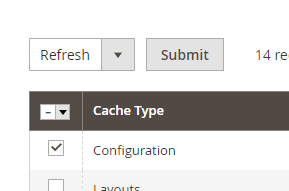

# Growcode_CreateAccountAfterPlaceOrder

## Module functionalities:
Customer have possibility to create account after place order. Customer can set password for account which will be create after place order. 

## Installation
 - `composer config repositories.growcode/module-client-contact vcs git@bitbucket.org:conversion-ecommerce-development/growcode-module-client-contact.git`
 - `composer require growcode/module-create-acount-after-place-order`
 - `bin/magento setup:upgrade`

## Configuration
 You should enable guest login on checkout(`Stores -> Configuration -> Sales ->  Checkout -> Enable Guest Checkout Login` switch to yes). After switch option you should clean configuration cache: `bin/magento cache:clean config` or `System -> Cache Management` select `Configuration` and Sumbit refresh

## Affected modules
Magento_Checkout

## DB schema/data changes
quote.customer_password_ciphertext

## CLI commands
### Usage

## REST endpoints

## Events
